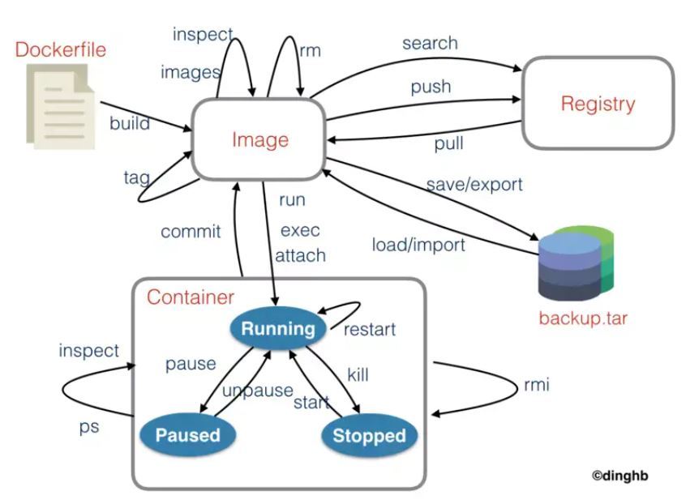

# docker容器卡死的解决方案

## 问题描述
1. 容器container卡死,如调用`docker stop/kill/restart`等卡住，但是`docker run/ps`等命令可以正常进行;具体参见如下图：
   
2. 如果`docker ps`等命令都不能执行，建议直接重启docker服务或重启机器；


## 解决方案
1. 引起该问题的原因是container堵死，我们只需要关闭相应的container即可，首先通过命令找到问题container的id，`sudo docker ps`
```
CONTAINER ID        IMAGE                                             COMMAND                  CREATED             STATUS              PORTS                                                                                                                       NAMES
8a5a015fa1bf        nvcr.io/nvidia/tritonserver:20.03-py3             "/bin/bash /data/ent…"   6 hours ago         Up 6 hours          0.0.0.0:19000->8000/tcp, 0.0.0.0:19001->8001/tcp                                                                            gpu-serving-4.13
34ed2acad1b2        harbor.do.proxima-ai.com/alpha/alpha-deploy:1.3   "sh /usr/local/bin/s…"   7 hours ago         Up 7 hours          0.0.0.0:30080->22/tcp, 0.0.0.0:30081->8086/tcp, 0.0.0.0:30082->8087/tcp, 0.0.0.0:30083->8088/tcp, 0.0.0.0:30084->8089/tcp   alpha-deploy-zxold

```
2. 找出其中的问题容器，假设为CONTAINER ID`34ed2acad1b2`, 此时需要找到该容器的启动进程，调用命令`ps auxwwf|grep 34ed2acad1b2`,显示如下：
```

zhangwd  35759  0.0  0.0  14684   928 pts/53   S+   17:18   0:00  |           \_ grep --color=auto 34ed2acad1b2
root     44600  0.0  0.0 107700  5620 ?        Sl   10:15   0:01  \_ containerd-shim -namespace moby -workdir /var/lib/containerd/io.containerd.runtime.v1.linux/moby/34ed2acad1b263a2398f12cfd55ef7ea44efc407b153c83a84b252d801680d25 -address /run/containerd/containerd.sock -containerd-binary /usr/bin/containerd -runtime-root /var/run/docker/runtime-nvidia

```
3. `44600`即为启动进行的id，杀掉该进程，即可将卡死的docker容器清除`sudo kill -9 44600`
4. 注意如果容器没有卡死，上述过程不work！！！！！！！！


## 参考
1. [在docker宿主机上查找指定容器内运行的所有进程的PID](https://www.cnblogs.com/devilwind/p/8612329.html)
2. [DOCKER入门，框架原理,镜像制作和资源列表](https://www.jianshu.com/p/04330a3f2ed9)