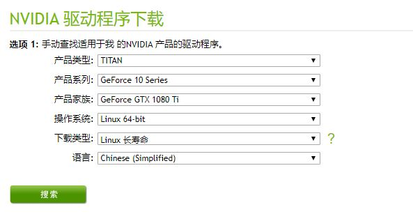
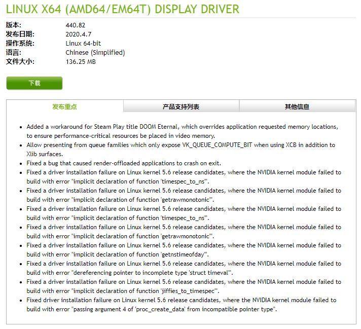

# 如何安装nvidia驱动
这里的安装是通过nvidia官网的安装包实现的；

1. 下载安装包，地址`https://www.nvidia.cn/Download/index.aspx?lang=cn`,如我的显卡是8卡的1080ti，那么根据需求选择：

进入下载页面

下载文件`NVIDIA-Linux-x86_64-440.82.run`

2. 利用root命令执行`sudo sh NVIDIA-Linux-x86_64-440.82.run`

3. 执行过程中会遇到各种问题，解决方案如下：
	1. 停止各种占用显卡的程序；
	2. 如果遇到*Ubuntu 安装nvidia驱动遇到 pre-install scipt failed 错误*问题， 参照博文[最全面解析 Ubuntu 16.04 安装nvidia驱动 以及各种错误](https://blog.csdn.net/u014561933/article/details/79958017)和[Ubuntu 安装nvidia驱动一直遇到 pre-install scipt failed 错误](https://blog.csdn.net/u014561933/article/details/79958130)
		```
		 sudo vi /etc/modprobe.d/blacklist-nouveau.conf 
		 #在文件 blacklist-nouveau.conf 中加入如下内容：
		  blacklist nouveau
		  blacklist lbm-nouveau
		  options nouveau modeset=0
		  alias nouveau off
		  alias lbm-nouveau off
		  #保存   :wq

		```
		```
		#禁用nouveau 内核模块
		echo options nouveau modeset=0 | sudo tee -a /etc/modprobe.d/nouveau-kms.conf
		sudo update-initramfs -u
		reboot #重启
		lsmod |grep nouveau #无显示则成功 当然驱动没了你的桌面分辨率会比较大。
		```
		
	3. 如果遇到* An NVIDIA kernel module 'nvidia-drm' appears to already be loaded in your kernel....*问题，参照[CUDA和NVIDIA-Driver安装问题](https://blog.csdn.net/xcls2010/article/details/89641853)和[[Solved] An NVIDIA kernel module ‘nvidia-drm’ appears to already be loaded in your kernel](https://clay-atlas.com/us/blog/2020/03/04/linux-english-note-how-to-disable-nvidia-drm/)
		```
		
		# 禁用图形目标
		sudo systemctl isolate multi-user.target
		 
		# 卸载Nvidia驱动程序
		modprobe -r nvidia-drm
		 
		安装驱动完成之后再次启动图形环境，可以使用此命令：
		 
		sudo systemctl start graphical.target

		```
		如果在没有图形界面的服务器上安装，只需执行`sudo modprobe -r nvidia-drm`即可
		
	4. 如果遇到* An NVIDIA kernel module 'nvidia' appears to already be loaded in your kernel. ...*问题，请参照[安装cuda8.0中所遇到的问题-解决办法](https://www.cnblogs.com/cxyxbk/p/6024610.html)
		```
		sudo apt-get purge nvidia-cuda*
		sudo apt-get purge nvidia-*
		```

	5. 如果遇到* You appear to be running an X server; ...*问题并且确定停止了占用显卡的程序， 请参照[How to install NVIDIA.run?](https://askubuntu.com/questions/149206/how-to-install-nvidia-run) 
		```
		sudo sh ./NVIDIAxxxx.run --no-x-check
		```
4. 经过如上步骤安装基本完成，再根据需要需要的cuda版本
		
	
